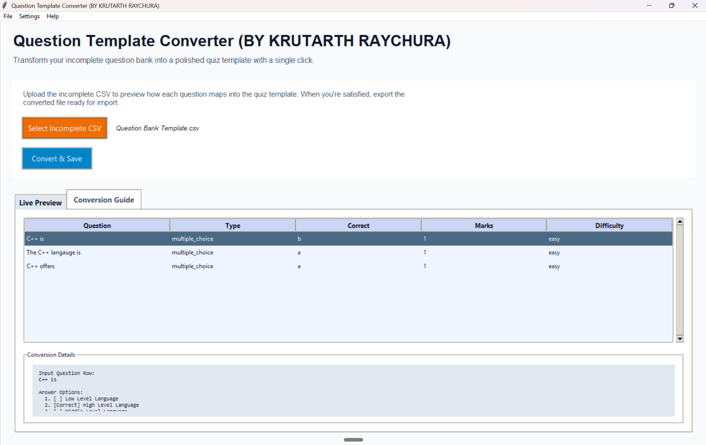
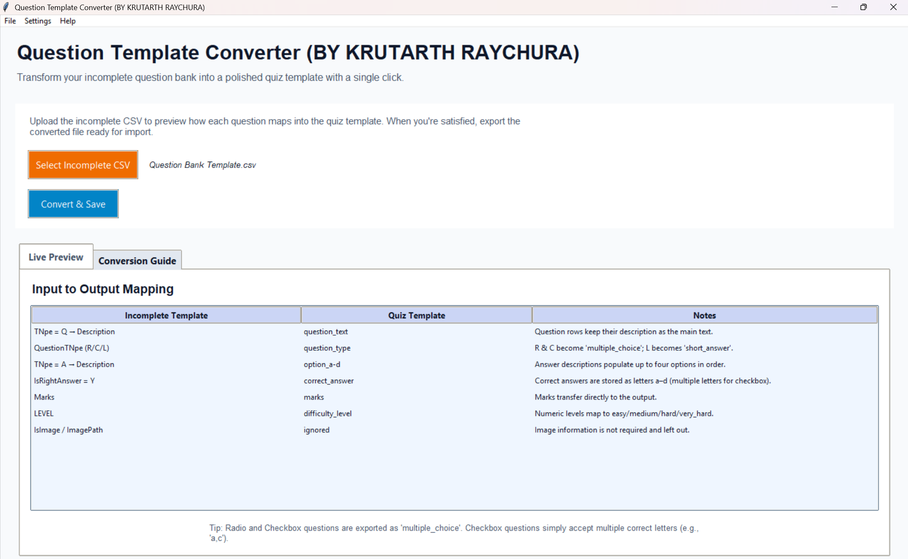
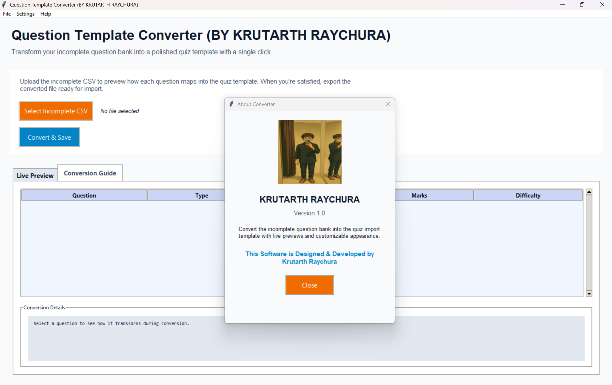

# Question Template Converter (BY KRUTARTH RAYCHURA)

## Quick Start
- **Clone the repo**
  ```bash
  git clone https://github.com/webKing021/Question-Template-Converter-Python.git
  cd Question-Template-Converter
  ```
- **Install dependencies** (requires Python 3.10+)
  ```bash
  pip install -r requirements.txt
  ```
- **Run the app**
  ```bash
  python converter_gui.py
  ```

## What it does
- **Input**: `Incomplete Template/Question Bank Template.csv` using the Q/A row format.
- **Conversion**: Groups each `Q` with its `A` options, maps difficulty, question type, and correct answers.
- **Output**: Quiz-ready CSV matching `Complete Template/quiz_questions_template.csv`.
- **Extras**: Live preview, conversion guide, activity log, theming options, and About dialog with branding.

## Using the GUI
1. Click **Select Incomplete CSV** and choose your source file.
2. Review the **Live Preview** and **Conversion Details** panes to confirm mappings.
3. (Optional) Visit **Settings → Appearance Settings…** to switch theme or fonts.
4. Press **Convert & Save** to export the formatted quiz CSV.
5. Open **Help → About Krutarth Raychura** to view software credits.

## Screenshots
- **Main window overview**
  
- **Conversion guide tab**
  
- **About dialog**
  

## Credits
This software is designed & developed by **Krutarth Raychura**.
